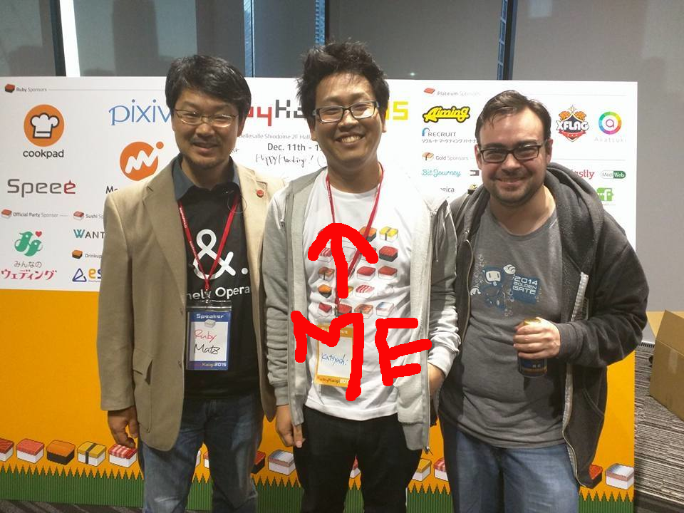

# （私的） RubyKaigi の歩き方

author
:   katsyoshi

institution
: Repro Inc.

theme
: prerubykaigi

allocated-time
: 5m

# self

{:relative_height='100' :text='matz, me, and yehuda'}

# self

{:relative_height='100' :text='asakusa.rb'}

# self

{:relative_width='70' :text='repro inc.'}

* 開発者募集中!!!
  * Ruby on Rails や Kafka をやりたい/できるひと
  * 上記以外にも
    * Go での配信基盤開発や
    * Java/Objective-C などでAndroid/iOS SDK開発も

# 今日のはなし

- セッションのたのしみかた
  - 個人的たのしみかたの話

# RubyKaigiとは？

- 日本最大 の Ruby 関連カンファレンス
- Ruby については世界一
  - 言語処理系では日本一（個人的感想です）

# RubyKaigi のたのしみかた

- セッションをたのしむ
- ひととのかかわりをたのしむ
- 場所をたのしむ

# 個人的なたのしみかた

- Ruby を知りたい！
- Ruby で楽しそうにしてる人とかかわりたい！
- おいしいものをたべたい！

# セッションをたのしむ

- 興味あるやつをみよう！
  - RubyKaigi 2024 タイムテーブル徹底解説 のレポートをみてみよう！
  - STORES.rb RubyKaigi 2024 直前スペシャル をみよう！
  - RubyKaigi 2024 直前LT祭 に参加して気持ちを盛りあげよう！

# セッションをたのしむ

- 最新のRubyを知ろう！
  - 新機能の話とか
    - 今回だと **Namespace** とか
  - いままでのものをよりよくした話とか
    - おなじみ **YJIT** とか
    - **LR parser** の話とか
- おもしろ Ruby とか
  - picoruby でキーボードうごかしたり
  - mruby を dreamcast とかゲーム機でうごかしたり

# ひととのかかわりをたのしむ

{:relative_height='100' :text='matz, me, and yehuda'}

# ひととのかかわりをたのしむ

- RubyKaigi 2015
- Matz と Wycats
- Wycats ってだれ？
  - Bundler, Cargo の生みの親
  - Ruby on Rails 3.0 に多大な貢献

# ひととのかかわりをたのしむ

- コミッターがそこらへんを歩いています
  - matz に聞きたいことも聞ける！
- トークしたひとがそこらへんを歩いています
  - さっきはなしてた人！

# 場所をたのしむ

- 今回は沖縄！
  - ごはんも、行きたいところも

# 場所をたのしむ

- ごはん
  - 山羊汁！、アグー豚！、 泡盛！、etc...
- いきたいところ
  - 島！ 海！ やんばる！

# タイムテーブルをつくる

- https://rubykaigi.smarthr.co.jp/2024
  - 毎回ありがとうございます

1. 興味あるやつ: 英語優先
1. 重要そうなやつ: 重要なので
1. しってる人がでてるやつ: 聞くセッションがないとか疲れたとか

# おわり
